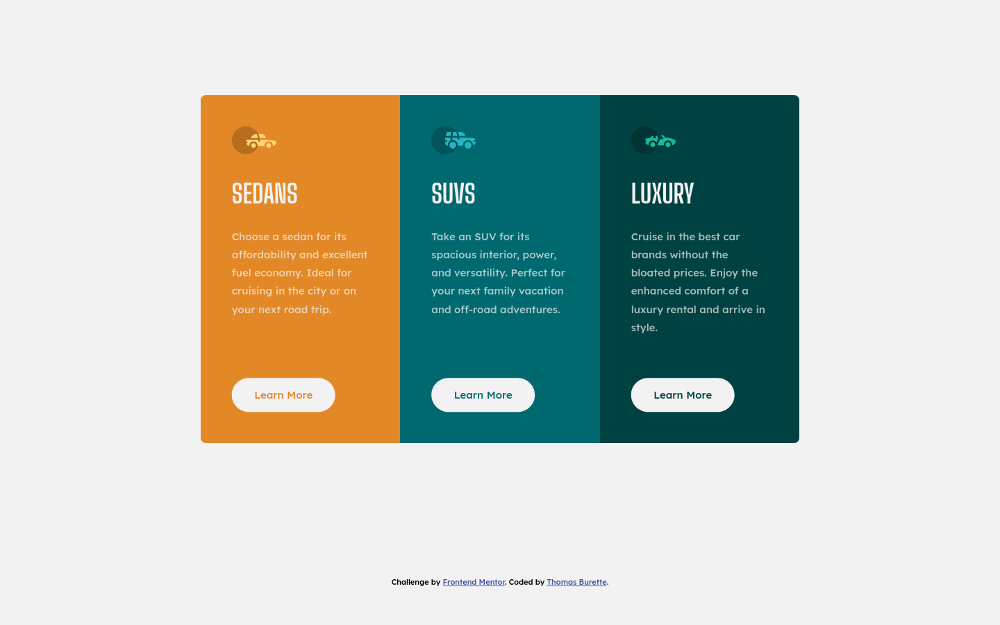

# Frontend Mentor - 3-column preview card component solution

This is my solution to the [3-column preview card component challenge on Frontend Mentor](https://www.frontendmentor.io/challenges/3column-preview-card-component-pH92eAR2-). 

## Table of contents

- [Frontend Mentor - 3-column preview card component solution](#frontend-mentor---3-column-preview-card-component-solution)
  - [Table of contents](#table-of-contents)
  - [Overview](#overview)
    - [The challenge](#the-challenge)
    - [Screenshot](#screenshot)
    - [Links](#links)
  - [My process](#my-process)
    - [Built with](#built-with)
    - [Notes](#notes)
      - [Fluid resizing of the main content and space around it when resizing](#fluid-resizing-of-the-main-content-and-space-around-it-when-resizing)
      - [Not quite evenly sized cards with flex](#not-quite-evenly-sized-cards-with-flex)
    - [Questions](#questions)
    - [How to have color slightly lighter without declaring a new color?](#how-to-have-color-slightly-lighter-without-declaring-a-new-color)
    - [How to avoid duplication when multiple BEM modifiers must undo declarations?](#how-to-avoid-duplication-when-multiple-bem-modifiers-must-undo-declarations)
  - [Author](#author)

## Overview

### The challenge

Users should be able to:

- View the optimal layout depending on their device's screen size
- See hover states for interactive elements

### Screenshot



### Links

- Solution URL: https://github.com/tburette/frontendmentor-3-column-preview-card-component
- Live Site URL: https://tburette.github.io/frontendmentor-3-column-preview-card-component

## My process

### Built with

- Semantic HTML5 markup
- CSS custom properties
- Flexbox
- Mobile-first workflow
- fluid layout

### Notes

#### Fluid resizing of the main content and space around it when resizing

I spent quite a bit of time building a fluid layout for a page with a main content 
that doesn't take the whole page (on a large screen). 

On large viewports : 
- the content is centered vertically and horizontally
- there is a maximum horizontal content width

On small viewports:
- there is a small minimum horizontal margin.
- there is a vertical margin

The horizontal and vertical margins smoothly transition from the smallest
viewport to the largest one. There main content never suddenly shift.

The result is this minimal CSS : https://gist.github.com/tburette/1b4375bdde8a2c6e8956c62094cde053#file-fluid-main-html


#### Not quite evenly sized cards with flex

On large screen the three cards are laid ouy horizontally with a flexbox.  I noticed that the text of the buttons would sometimes be on one line and
sometimes on two lines. 

The problem was that the three cards weren't quite the same width. Fixed it by adding width: 100% on the cards.


### Questions


### How to have color slightly lighter without declaring a new color?

In the reference design it seems that the 'learn More' text in the buttons 
have a color slightly whiter than the card background. 
I Didn't know how to replicate it without declaring three new colors so I didn't do it.
Opacity does the trick but it also affects the background color, not just the text.


### How to avoid duplication when multiple BEM modifiers must undo declarations?

I used BEM for the three cards : `.card`, `.card--sedan`, `.card--suv` and `.card--luxury`.

A problem I have is that there are declarations in the `.card` that must be undone by the modifiers.

I end up with duplication:

```css
.card--sedan {
  /* a bunch of declarations that undo declarations in .card {} */
}

.card--suv {
  /* a bunch of declarations that undo declarations in .card {} */
}

.card--luxury {
  /* a bunch of declarations that undo declarations in .card {} */
}
```


## Author

- Website - [Thomas Burette](http://thomasburette.com/)
- Frontend Mentor - [@tburette](https://www.frontendmentor.io/profile/tburette)
- Twitter - [@tburette](https://twitter.com/tburette)